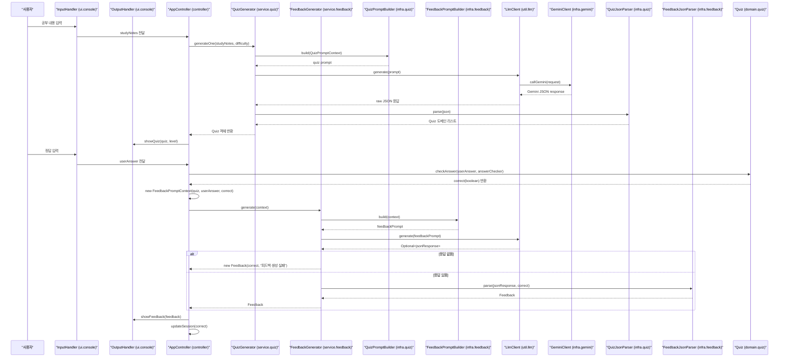

# EduMate
**“공부는 했지만, 진짜 이해했는지는 모르겠는 순간을 위한 동료.”**

EduMate는 사용자가 공부한 내용을 기반으로 맞춤형 퀴즈를 생성하고, 정답에 따른 학습 피드백을 제공하는 LLM 기반 콘솔 학습 도우미입니다.

## 프로젝트 개요
EduMate는 학습 과정의 “이해”와 “성장”에 초점을 맞춘 Java 기반 콘솔 챗봇 프로젝트입니다.
사용자가 공부한 내용을 간단히 입력하면, EduMate는 이를 기반으로 질문을 던지고 피드백을 제공하여 복습을 유도합니다.

이 프로젝트는 우아한테크코스 프리코스 4~5주차 자유 미션으로 진행되며,
지난 3주 동안 배운 객체지향 설계, 예외 처리 등을 실제 서비스 형태로 적용하는 것을 목표로 합니다.

✔ 목표
- 복잡한 로직을 객체지향적으로 분리하는 연습
- SRP 기반 설계 및 클린코드 실천
- LLM API와 백엔드 로직 연동
- 단위 책임별 테스트 작성

## 시연 영상 & 이미지
#### 퀴즈 생성 및 정답 피드백 시연 영상
https://github.com/user-attachments/assets/08db9567-51b5-4fe2-b512-869d2f542bad

#### 2연속 정답 시 난이도 상향 및 오답 피드백 이미지


## 핵심 기능

- 사용자가 공부한 내용을 바탕으로 맞춤형 퀴즈 자동 생성
- 사용자의 입력에 따라 정답 판별 (숫자/문자 모두 지원)
- LLM 기반 피드백 생성
- 정답/오답 흐름 기반 난이도 자동 조절

## 책임 분리 원칙 (SRP)

- QuizGenerator: LLM에 프롬프트 요청 → JSON 응답 → Quiz 도메인 변환
- FeedbackGenerator: 사용자의 정답 여부 기반으로 피드백 생성
- GeminiClient: HTTP 통신만 담당 (요청/응답 로직 분리)
- QuizPromptBuilder: 요청 프롬프트 생성
- GeminiRequestBuilder: LLM 요청 JSON만 생성
- GeminiResponseParser: Gemini 응답 JSON만 파싱
- AnswerChecker: 정답 판별 로직만 담당

## 동작 흐름
```markdown
EduMate는 UI, Controller, Service, Domain, Infra, LLM Util 레이어로 나누어 설계되어 있으며,
LLM 호출과 Prompt/JSON 처리 로직을 별도의 계층으로 분리하여 유지보수성과 확장성을 높였습니다.
```
### 1) 전체 플로우



## 페르소나
| 이름 | 나이 | 상황 | 필요 |
| --- | --- | --- | --- |
| 지은 | 23세 | 프로그래밍을 처음 배우는 대학생 | 공부는 했지만 개념을 정확히 이해했는지 스스로 점검하기 어려움 |
| 민수 | 27세 | 이직 준비 중인 주니어 개발자 | 학습한 내용을 복습하고, 누락된 부분을 피드백받으며 체계적으로 공부하고 싶음 |

## 테스트 전략 다이어그램


## 향후 개발 계획 (Roadmap)

 1. 꼬리질문 생성 기능
 2. Console → Web UI 확장
 3. 세션 관리(사용자의 약점 추적)
 4. 학습 결과 리포트 생성

